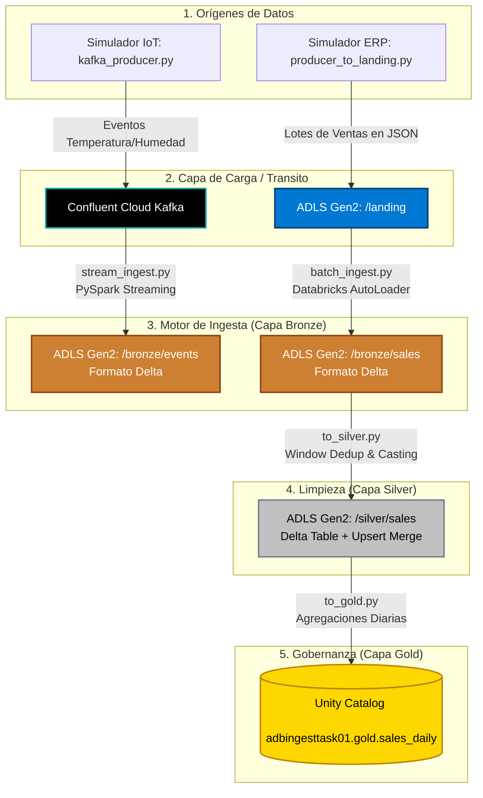

# FarmIA Ingest Engine

Motor de ingesta para el lakehouse de **FarmIA** en Databricks. Implementa pipelines batch (Autoloader) y streaming (Kafka) que escriben en formato Delta en ADLS Gen2, transitando por las capas: 

    Landing -> Bronze -> Silver -> Gold

## Diagrama de Arquitectura

El diseño sigue una Arquitectura Medallion completamente desacoplada:



## Requisitos
- Databricks Workspace con Unity Catalog y cluster que soporte Spark 3.x y Delta.
- Cuenta ADLS Gen2 accesible desde Databricks.
- Cuenta de Concluent Cloud.
- Credenciales para ADLS y Confluent Cloud.
- Azure Key Vault conectado mediante Secret Scopes en Databricks (`ingest-task-scope-01`).
- Python 3.10+ y **Java 17** para testing y empaquetado local.

## Instalación local y empaquetado
1. Crear virtualenv e instalar dependencias:
```bash
python -m venv .venv
pip install -r requirements.txt
pip install pytest pyspark pyyaml delta-spark
```

2. Empaquetar como wheel:
```bash
python setup.py bdist_wheel
```
*Esto generará el empaquetado en la carpeta `dist/`.

## Tests
Para ejecutar la batería de pruebas localmente sin Databricks:
```bash
pytest -v
```

## Despliegue en Databricks
1. **Secretos:** 

    En Azure Key Vault, asegúrate de tener el secreto `kafka-api-secret` con el secreto
    necesario para conectarte a tu cluster de Kafka y `storage-account-key` con la llave necesaria para conectarte
    a tu cuenta de almacenamiento de Microsoft Azure. Para este último caso, también se ha de añadir la siguiente configuración de spark
    en el cluster usado para que se ejecuten los jobs en Databricks:

        fs.azure.account.key.staingesttask01.dfs.core.windows.net {{secrets/ingest-task-scope-01/storage-account-key}}
        
    Para ello, se ha de crear el Secret Scope en nuestro workspace y a continuación crear los secretos con los siguientes comandos en Databricks CLI:

            databricks secrets create-scope ingest-task-scope-01
            databricks secrets create-secret ingest-task-scope-01 kafka-api-secret
            databricks secrets create-secret ingest-task-scope-01 storage-account-key

2. **Subir archivos:** 
   - Sube el archivo `.whl` generado a tu volumen de Unity Catalog (ej: `/Volumes/adbingesttask01/default/libs/`).
   - Sube tu `dataset_config.yaml` y esquema `sales.json` a tu volumen de Unity Catalog (ej: `/Volumes/adbingesttask01/default/confs/`).

4. **Crear Jobs (Spark Python task):**
    - **Creación:** Ejecutar los .json de los 4 jobs desde el Datbricks CLI de la siguiente manera:
          
          databricks jobs create  --json "@job_1_producer.json"
          databricks jobs create  --json "@job_2_batch_medallion.json"
          databricks jobs create  --json "@job_3_streaming.json"
          databricks jobs create  --json "@job_4_kafka_producer.json"
      Se ha de cambiar previamente el ID del cluster con el que se quieren ejecutar los jobs en el apartado **existing_cluster_id**
    - **Package:** Actualizar ruta al wheel en el volumen (`/Volumes/.../ingest_engine-x.x.x-py3-none-any.whl`).
    - **Parameters:** Actualizar ruta al archivo de configuración `--config /ruta/al/dataset_config.yaml`
    - **Entry points disponibles:**
        - `run_batch_ingest`
        - `run_stream_ingest`
        - `run_to_silver`
        - `run_to_gold`
        - `run_kafka_producer`
        - `run_landing_producer`
    - **Cambios:** Para su ejecución correcta hace falta cambiar en el archivo `constants.py` los valores de
    SECRET_SCOPE y SCHEMA_GOLD con los valores del scope creado y el esquema de Delta Lake donde quieres que se guarde la tabla Gold.
   Además, en el archivo de configuración `dataset_config.yaml` los distintos paths del almacenamiento, la ubicación en el Volumen
   de Databricks del esquema y la configuración de Kafka como el Bootstrap o el Api Key. Recuerdo la necesidad de cambiar también las rutas de
      **whl**, **parameters** y **existing_cluster_id** en los json de la creación de los jobs. 

## Ejecución de la Ingesta
Para procesar los datos a través de la Arquitectura Medallón, sigue el orden de ejecución detallado a continuación. Todo el flujo se controla mediante los **Jobs de Databricks** previamente configurados.

### 1. Ingesta en Tiempo Real (Streaming - Eventos IoT)
Para probar el flujo en tiempo real desde Kafka hasta la capa Bronze, el orden de los factores sí altera el producto.
1. **Inicia el Receptor (Listener):** Ejecuta el Job 3 con el *entry point* `run_stream_ingest`. Este proceso se quedará en estado *Running* de manera indefinida, esperando nuevos mensajes.
2. **Inicia el Productor (Sender):** Mientras el receptor sigue activo, lanza el Job 4 con el *entry point* `run_kafka_producer`. Esto generará 15 lotes de temperatura y humedad enviados cada 5 segundos a Confluent Cloud.
3. **Verifica:** En la terminal del Job de Streaming, verás cómo los micro-batches procesan los datos instantáneamente y los escriben en formato Delta en `abfss://.../bronze/events`. Una vez terminado el productor, puedes cancelar manualmente el Job de streaming.

### 2. Ingesta por Lotes (Batch - Ventas ERP)
Este flujo simula la carga de archivos históricos o cierres diarios mediante Databricks AutoLoader.
1. **Genera los datos crudos:** Ejecuta el Job 1 con *entry point* `run_landing_producer`. Esto escribirá archivos JSON simulando pedidos de ventas directamente en tu capa `/landing`.
2. **Ejecuta el AutoLoader:** Lanza el Job 2 que tiene la task 1 con el *entry point* `run_batch_ingest`. Gracias a la configuración `trigger(availableNow=True)`, el proceso leerá de golpe todos los archivos JSON nuevos de Landing, los insertará en `/bronze/sales` con sus metadatos correspondientes y el Job se apagará automáticamente al terminar.
Este Job también está configurado para lanzarse de manera automática cada 1 hora para las ingestas Batch.

### 3. Refinamiento y Negocio (Capas Silver y Gold)
Una vez que los datos crudos están en la capa Bronze, toca limpiarlos y prepararlos para el negocio:
1. **Limpieza (Silver):** Una vez ha terminado la task 1 del Job 2, se ejecutará la task 2 con *entry point* `run_to_silver`. Este script leerá la tabla de ventas de Bronze, eliminará registros duplicados mediante funciones Window, casteará los tipos de datos (fechas, enteros) y hará un `MERGE` (Upsert) seguro en `/silver/sales`.
2. **Agregación (Gold):** Finalmente, lanza se lanza la task 3 del job 2 con *entry point* `run_to_gold`. Leerá los datos limpios de Silver, calculará los ingresos (`total_revenue`) y unidades (`total_units`) agrupados por fecha y región, y sobrescribirá la tabla particionada directamente en **Unity Catalog** (`adbingesttask01.gold.sales_daily`).

## Notas
- Cada dataset debe tener su propio `checkpointLocation` único.
- Para batch con Autoloader se usa `trigger(availableNow=True)` para procesar nuevos archivos y terminar de forma limpia.
- Para streaming se usa `query.awaitTermination()`. Inicia siempre el Job de streaming *antes* que el simulador del productor Kafka.
- **Una vez finalizadas las pruebas de ejecución, recordad apagar los clusters o desactivar o borrar los jobs horarios y de producción streaming (Job 2 y 3).**
